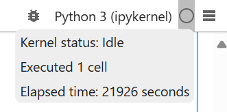
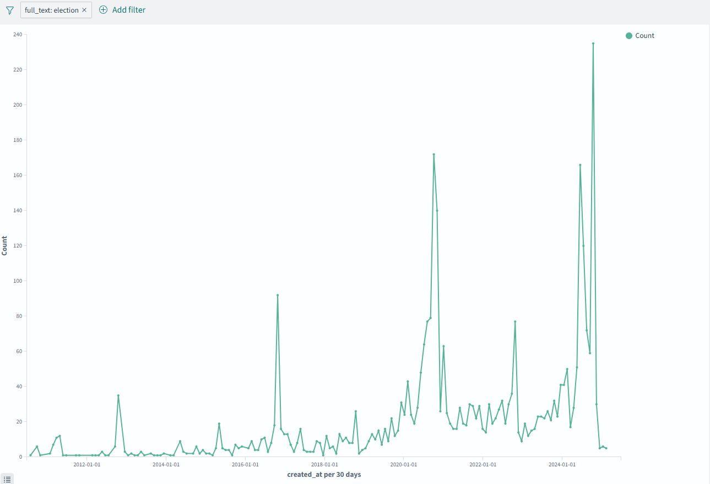

+++
author = ["Xiao Xu"]
title = "Counting More Words"
date = "2025-06-27"
tags = [
    "codeday",
    "memetics",
	 "opensearch"
]
+++
Now that I'm more or less done with school (getting my bachelor's in CS! yay!) I can finally dedicate a bit more time to this. A few weeks ago, I threw together a simple word counter for a single account's archive.json. Now I'd like to expand that out to a larger dataset; namely, the post.csv from [community archive's huggingface]([CommunityArchive/CommunityArchive at main](https://huggingface.co/datasets/CommunityArchive/CommunityArchive/tree/main).

First things first, I actually have to load the rather sizable file. I've used pandas in the past for machine learning, so I'm pretty sure that'll work:
```python
import pandas as pd
data = pd.read_csv('../post.csv')
data.info()
```
This tells me what the columns are, along with some other information:
```text
<class 'pandas.core.frame.DataFrame'>
RangeIndex: 6135978 entries, 0 to 6135977
Data columns (total 14 columns):
 #   Column             Dtype 
---  ------             ----- 
 0   tweet_id           object
 1   account_id         object
 2   created_at         object
 3   full_text          object
 4   retweet_count      object
 5   favorite_count     object
 6   reply_to_tweet_id  object
 7   reply_to_user_id   object
 8   reply_to_username  object
 9   archive_upload_id  object
 10  updated_at         object
 11  username           object
 12  temporal_subset    object
 13  topic              object
dtypes: object(14)
memory usage: 655.4+ MB
```
That's a lot of data! It's probably enough that it's worth avoiding writing out regular python loops. In fact, I probably want to avoid using python altogether. If I search for a word and get the count to plot it over time:
```python
import matplotlib.pyplot as plt
import datetime as dt
word = "election"
start_date = dt.date(2020, 1, 1)
end_date = dt.date(2022, 1, 1)

df["matches"] = df["full_text"].str.lower().str.count(rf"\b{word}\b")
daily = df.groupby(df["created_at"].dt.date)["matches"].sum()
graph = daily.plot()
graph.set_xlim(pd.to_datetime(start_date), pd.to_datetime(end_date))
plt.show()
```
This takes roughly ten seconds to run. Now, I haven't used pandas so AI wrote a lot of this and I'm not sure it's the most efficient, but spending several seconds per word really isn't going to work if I also want to search for spikes in word usage or anything like that. One of my attempts at it ran for six hours before I cancelled it:


Clearly I should try something else. Coincidentally, I've been trying to get started with OpenSearch for an internship, and while I'm still a little fuzzy on what exactly it's for, it does sound like it'd be suitable for my purposes.

First off, I need to get an instance of OpenSearch up and running. They provide a [quickstart using docker]([Installation quickstart - OpenSearch Documentation](https://docs.opensearch.org/docs/latest/getting-started/quickstart/), but the example compose uses a couple nodes and a security plugin that I don't need so instead I'll be using this modified version:
```docker compose
services:
  opensearch:
    image: opensearchproject/opensearch:latest
    container_name: opensearch-single
    environment:
      - cluster.name=opensearch-cluster
      - node.name=opensearch-single
      - discovery.type=single-node # Single node discovery
      - bootstrap.memory_lock=true
      - "OPENSEARCH_JAVA_OPTS=-Xms1g -Xmx16g" # Increase memory for handling multiple GB of tweet data, this is probably overkill
      - OPENSEARCH_INITIAL_ADMIN_PASSWORD=${OPENSEARCH_INITIAL_ADMIN_PASSWORD:-admin123} # Default password for local dev, doesn't currently use it
      - "DISABLE_INSTALL_DEMO_CONFIG=true" # Disable demo config for cleaner setup
      - "DISABLE_SECURITY_PLUGIN=true" # Disable security for easier local development
    ulimits:
      memlock:
        soft: -1
        hard: -1
      nofile:
        soft: 65536
        hard: 65536
    volumes:
      - opensearch-data:/usr/share/opensearch/data
    ports:
      - 9200:9200 # REST API
      - 9600:9600 # Performance Analyzer
    networks:
      - opensearch-net
  opensearch-dashboards:
    image: opensearchproject/opensearch-dashboards:latest
    container_name: opensearch-dashboards
    ports:
      - 5601:5601
    expose:
      - "5601"
    environment:
      OPENSEARCH_HOSTS: '["http://opensearch:9200"]' # Updated to use single node without HTTPS
      DISABLE_SECURITY_DASHBOARDS_PLUGIN: "true" # Disable security for easier local development
    networks:
      - opensearch-net

volumes:
  opensearch-data:

networks:
  opensearch-net:
```
After bringing this up with `docker compose up`, I use this script (mostly written with the new [Gemini CLI]([google-gemini/gemini-cli: An open-source AI agent that brings the power of Gemini directly into your terminal.](https://github.com/google-gemini/gemini-cli) to ingest all my data:
```typescript
import { createReadStream } from 'fs';
import { parse } from 'csv-parse';
import { Client } from '@opensearch-project/opensearch';
  
const BATCH_SIZE = 1000;
const INDEX_NAME = 'posts';

// Configure the OpenSearch client
// Connects to the 'opensearch' service from docker-compose.yml
const client = new Client({
  node: process.env.OPENSEARCH_URL || 'http://localhost:9200',
});

async function ingestCSV(filePath: string) {
  console.log(`Starting ingestion of ${filePath} into index "${INDEX_NAME}"...`);
  
  const parser = createReadStream(filePath).pipe(
    parse({
      columns: true, // Use the first row as headers
      trim: true,
    })
  );

  let batch: any[] = [];
  let rowCount = 0;

  // Check if the index exists, and create it if it doesn't
  const { body: indexExists } = await client.indices.exists({ index: INDEX_NAME });
  if (!indexExists) {
      console.log(`Index "${INDEX_NAME}" does not exist. Creating...`);
      await client.indices.create({
          index: INDEX_NAME,
          body: {
              mappings: {
                  properties: {
                      tweet_id: { type: 'keyword' },
                      account_id: { type: 'keyword' },
                      created_at: { type: 'date' }, // Use default date mapping
                      full_text: { type: 'text' },
	                  retweet_count: { type: 'integer' },
	                  favorite_count: { type: 'integer' },
	                  reply_to_tweet_id: { type: 'keyword' },
	                  reply_to_user_id: { type: 'keyword' },
	                  reply_to_username: { type: 'keyword' },
	                  username: { type: 'keyword' }.
                  },
              },
          },
      });
      console.log(`Index "${INDEX_NAME}" created.`);
  } else {
      console.log(`Index "${INDEX_NAME}" already exists.`);
  }

  for await (const record of parser) {
    // Convert created_at to ISO 8601 format before indexing
    if (record.created_at) {
      try {
        // The Date constructor can parse 'YYYY-MM-DD HH:MM:SS+ZZ:ZZ'
        record.created_at = new Date(record.created_at).toISOString();
      } catch (e) {
        console.error(`Could not parse date: ${record.created_at}`);
        // Set to null if parsing fails. OpenSearch will reject if the field is not nullable.
        record.created_at = null;
      }
    }

    batch.push({ index: { _index: INDEX_NAME } });
    batch.push(record);
    rowCount++;

    if (batch.length >= BATCH_SIZE * 2) {
      await sendBulkRequest(batch);
      console.log(`Ingested ${rowCount} rows...`);
      batch = [];
    }
  }

  // Ingest any remaining documents
  if (batch.length > 0) {
    await sendBulkRequest(batch);
  }

  console.log(`Finished ingestion.`);
  console.log(`Total rows processed: ${rowCount}`);

  // Refresh the index to make the documents searchable
  await client.indices.refresh({ index: INDEX_NAME });
  const countResponse = await client.count({ index: INDEX_NAME });
  console.log(`Total documents in index "${INDEX_NAME}": ${countResponse.body.count}`);
}

async function sendBulkRequest(batch: any[]) {
  try {
    const response = await client.bulk({
      body: batch,
    });

    if (response.body.errors) {
      console.error('Bulk ingestion had errors:');
      // Log detailed information for failed items
      response.body.items.forEach((item: any) => {
        if (item.index && item.index.error) {
          console.error(`Error for item ${item.index._id}:`, item.index.error);
        }
      });
    }
  } catch (error) {
    console.error('Error during bulk ingestion:', error);
    // It might be useful to exit or implement a retry mechanism here
    process.exit(1);
  }
}

// --- Script execution ---
async function main() {
  const filePath = process.argv[2];
  if (!filePath) {
    console.error('Please provide the path to the CSV file.');
    console.error('Usage: bun ingest_csv.ts <path-to-csv-file>');
    process.exit(1);
  }

  try {
    await ingestCSV(filePath);
  } catch (error) {
    console.error('An unexpected error occurred:', error);
    process.exit(1);
  }
}

main();
```
Now, I'm even less familiar with typescript and OpenSearch than I am pandas, but this does actually seem to work. Now all I need to do is query OpenSearch to make sure that the data is in there:
```bash
curl -X GET "http://localhost:9200/posts/_search?pretty" -H "Content-Type: application/json" -d '{"size": 3}'
```
Interestingly, the return seems to indicate that OpenSearch automatically created mappings for some of the columns that I didn't define, so that's neat. Still, since the data is in there I can just use the OpenSearch dashboard to generate graphs:

Searching for the word "election", there's a spike every October or so on years where there's a US Presidential election, so it seems like it's working as expected. And more importantly, I can search for new words almost instantly; the logs indicate that the requests are handled in just dozens of milliseconds. This is literally many orders of magnitude faster than my (likely very poor) pandas implementation. Nice!