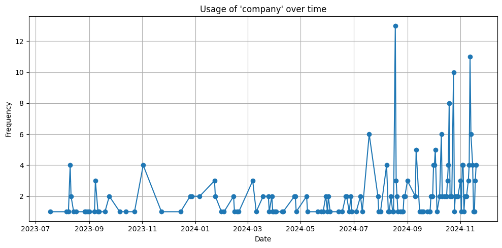

+++
author = ["Xiao Xu"]
title = "Counting Words"
date = "2025-06-05"
tags = [
    "codeday",
    "memetics",
]
+++
For my project with CodeDay, I'm probably going to try and find spikes in activity in certain concepts. This will be useful both as a way to find trends or concepts that have gone viral, but additionally serve as a way to detect potential propaganda attacks.

To begin with, I'm just going to try and detect spikes in words, rather than worry about how to cluster concepts semantically and detect spikes in clusters. To start with, I'll sort the tweets into threads:
```python
import json
with open('archive.json', 'r', encoding='utf-8') as f:
    data = json.load(f)

# Get account id
# data is a dict, account is a list with one item that is a dict with key account which is another dict
account_id = data["account"][0]["account"]["accountId"]

# Get all tweets that are not retweets
tweets = [tweet for tweet in data.get("tweets", []) if not tweet.get("retweeted", False)]

# Create a map of id:tweet
id_to_tweet = {}
for tweet in tweets:
    tweet = tweet["tweet"]
    id_to_tweet[tweet["id"]] = tweet

# Group tweets into threads
reply_to_parent = {}
for tweet in tweets:
    tweet = tweet["tweet"]
    if tweet.get("in_reply_to_user_id") == account_id:
        reply_to_parent[tweet["id"]] = tweet["in_reply_to_status_id"]

# Get the text of tweets and threads
# Assumes that the list of tweets is in chronological order
id_to_text = {}
for tweet in tweets:
    tweet = tweet["tweet"]
    tweet_id = tweet["id"]
    tweet_text = tweet["full_text"]
    while tweet_id in reply_to_parent:
            tweet_id = reply_to_parent[tweet_id]
    if tweet_id in id_to_text:
        id_to_text[tweet_id] += " " + tweet_text
    else:
        id_to_text[tweet_id] = tweet_text
```
This allows me to access the text and the raw tweet using the ID. Next, I have to actually count how many times each word appears per day:
```python
from collections import Counter
import re
import requests
stopwords_list = requests.get("https://gist.githubusercontent.com/rg089/35e00abf8941d72d419224cfd5b5925d/raw/12d899b70156fd0041fa9778d657330b024b959c/stopwords.txt").content
stopwords = set(stopwords_list.decode().splitlines()) 

def get_date(created_at_str):
    parts = created_at_str.split()
    if len(parts) < 6:
        return "UnknownDate"
    return parts[1] + parts[2] + parts[5]

words = {}

for tweet_id in id_to_text:
    if tweet_id not in id_to_tweet:
        continue
    created_at = id_to_tweet[tweet_id].get("created_at")
    if not created_at:
        continue
    date = get_date(created_at)
    raw_text = id_to_text[tweet_id].lower()
    cleaned_text = re.sub(r"http\S+|[^a-z\s]", "", raw_text)
    word_list = cleaned_text.split()
    for word in word_list:
        if word in stopwords:
            continue
        if word not in words:
            words[word] = Counter()
        words[word][date] += 1
```
This provides a dictionary of words, where each word corresponds to a counter (a python dictionary that counts things) of dates. For example, for the word guess:
```
guess: {'Nov192024': 2, 'Jan252024': 1, 'Jan232024': 1, 'Jan172024': 1, 'Jan152024': 1, 'Jan052024': 1, 'Jan032024': 1, 'Dec282023': 1, 'Dec262023': 1, 'Dec162023': 2, 'Dec072023': 2, 'Nov192023': 1, 'Nov072023': 1, 'Nov022023': 4, 'Oct282023': 1...
```
Now, all these dictionaries and sets are nice and efficient, but this isn't really human readable. It'd be much better if this was on a plot or something. Fortunately, while I'm not very good with matplotlib, ChatGPT is reasonably proficient:
```python
import matplotlib.pyplot as plt
from datetime import datetime

def plot_word_frequency(word, words_dict):
    if word not in words_dict:
        print(f"'{word}' not found in data.")
        return

    # Extract the daily counts for the word
    counts = words_dict[word]

    # Convert to a sorted list of (date, count) tuples
    date_counts = sorted(
        ((datetime.strptime(date_str, "%b%d%Y"), count) for date_str, count in counts.items()),
        key=lambda x: x[0]
    )

    # Unpack dates and counts
    dates, frequencies = zip(*date_counts)

    # Plotting
    plt.figure(figsize=(10, 5))
    plt.plot(dates, frequencies, marker='o')
    plt.title(f"Usage of '{word}' over time")
    plt.xlabel("Date")
    plt.ylabel("Frequency")
    plt.grid(True)
    plt.tight_layout()
    plt.show()
```
Here's the output for the word "company":

I still have to do some more work adapting this code to (and acquiring) a larger dataset, but this is most of the way there.