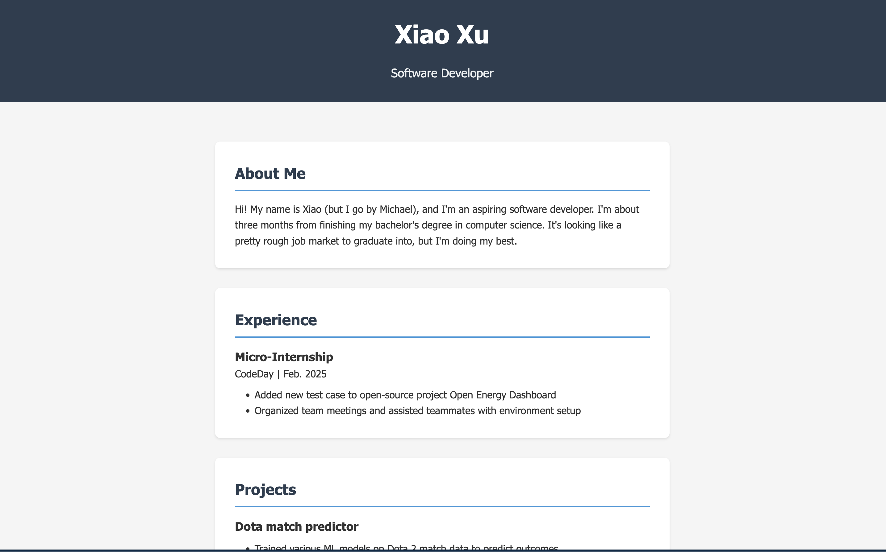

+++
author = ["Xiao Xu"]
title = "Hello World!"
date = "2025-05-20"
tags = [
    "hugo",
    "site",
]
+++
Hello world!

As part of a CodeDay Labs project I'm working on, I'm supposed to get a devblog up and running. I figured since I already had a *very* basic personal website running I could just attach it to that. One issue, though: it was just html and css, and I don't want to deal with writing posts out in raw html.

In case you couldn't tell from my old page, I'm not great at front end stuff. However, I already use Obsidian to take notes, and I was aware of Obsidian Publish, so I figured that there was probably some kind of way to set up a blog using Obsidian (and without paying for Publish). Also, my site is already on Cloudflare pages, so it'd be nice if I could keep using that. 

Fortunately, someone has, in fact, already done that, and posted their process to a blog:
https://ingau.me/blog/how-i-write-my-blogs-in-obsidian-and-publish-instantly/

I haven't followed the directions step-by-step (I'm using a different theme, for one) but my process was more or less the same. 